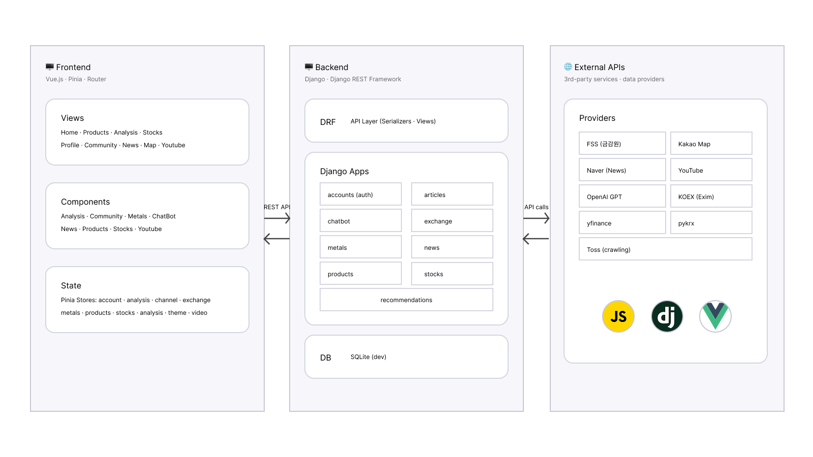
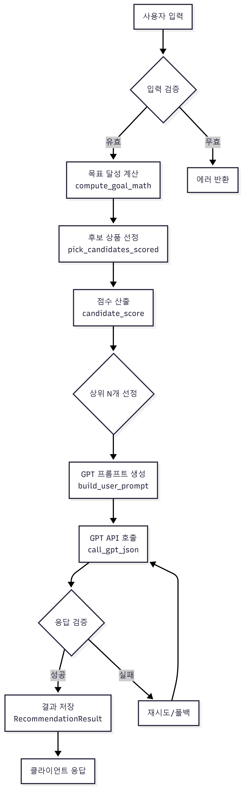
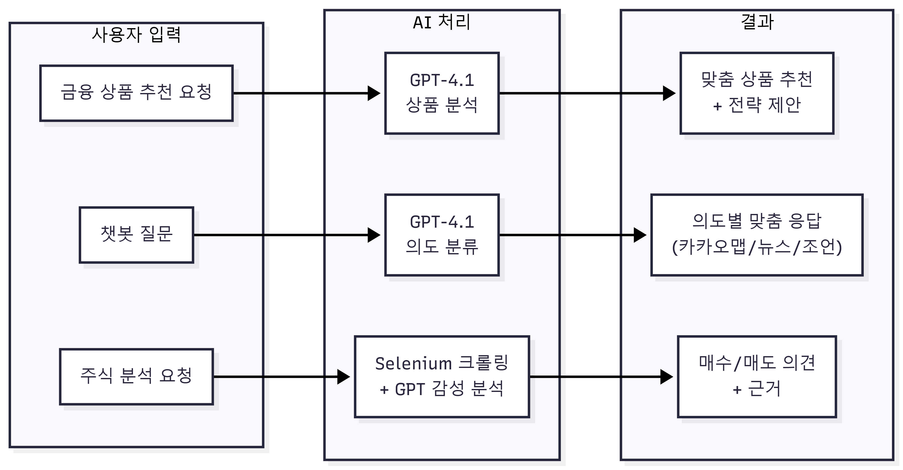
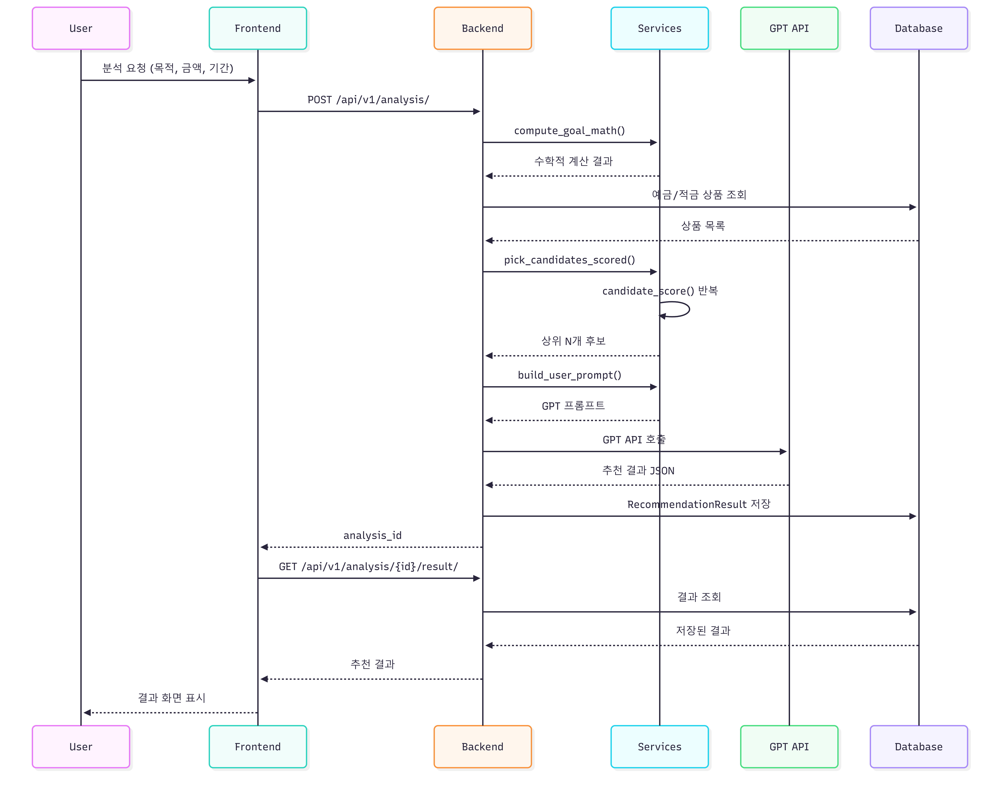
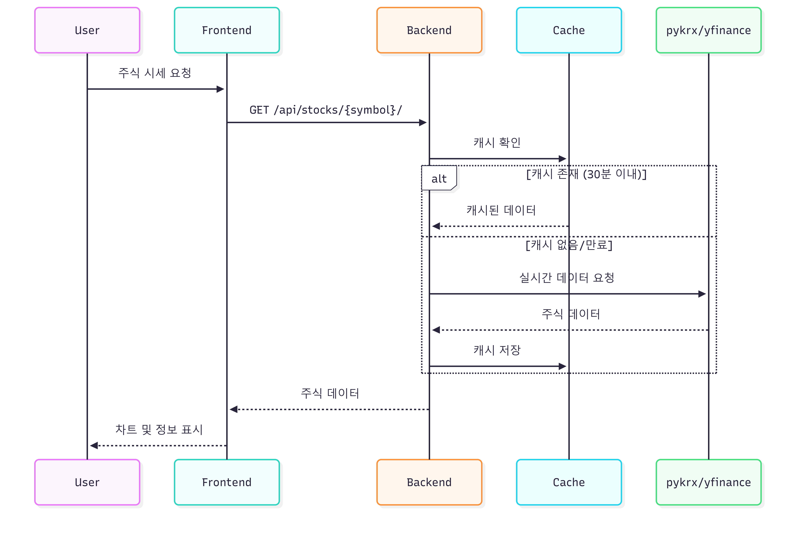

# AI 기반 금융 상품 추천 서비스

> **SSAFY 1학기 최종 프로젝트**  
> AI 기술을 활용한 맞춤형 금융 상품 추천 및 종합 금융 정보 제공 플랫폼

---

## 목차

1. [프로젝트 개요](#-프로젝트-개요)
2. [팀원 정보 및 역할](#-팀원-정보-및-역할)
3. [주요 기능](#-주요-기능)
4. [기술 스택](#-기술-스택)
5. [시스템 아키텍처](#-시스템-아키텍처)
6. [AI 추천 알고리즘](#-ai-추천-알고리즘)
7. [생성형 AI 활용](#-생성형-ai-활용)
8. [DB 모델링 (ERD)](#-db-모델링-erd)
9. [컴포넌트 구조도](#-컴포넌트-구조도)
10. [시퀀스 다이어그램](#-시퀀스-다이어그램)
11. [API 명세](#-api-명세)
12. [설치 및 실행](#-설치-및-실행)
13. [프로젝트 후기](#-프로젝트-후기)

---

## 프로젝트 개요

### 서비스명: **F!NK**

현대인들의 복잡한 금융 의사결정을 돕기 위해 개발된 **AI 기반 맞춤형 금융 서비스**입니다.
사용자의 목적/자산/기간을 입력하면 목표 달성 가능성을 수학적으로 검증하고, 최적의 금융 상품(예·적금) 조합을 추천합니다.
사용자가 직접 금융 상품을 비교 분석할 수 있고, 예·적금 뿐만 아니라 주식도 확인할 수 있는 서비스입니다.
AI는 증권사 커뮤니티 크롤링, 관련 뉴스, Youtube 영상을 근거로 현재 주식의 매수·매도 결정을 도와줍니다.

### 핵심 가치


1. **목표 중심 추천**
     - 주거/저축/여행 등 목적에 맞는 상품 추천
2. **AI 분석**
     - GPT-4.1을 활용한 전문가 수준의 분석
3. **통합 정보**
     - 예적금, 주식, 환율, 금속 시세 한눈에
4. **스마트 챗봇**
     - 7가지 의도 분류 기반 맞춤 응답


### 차별점

1. **수학적 검증**
   - 단순 금리 비교가 아닌, 목표 달성 가능성을 수학적으로 계산
2. **이자소득세 반영**
   - 실제 수령액 기준 15.4% 세금 자동 계산
3. **복합 전략**
   - 예금+적금 조합으로 최적의 포트폴리오 제안
4. **실시간 감정 분석**
   - 토스 증권 커뮤니티 크롤링 + AI 분석

---

## 팀원 정보 및 역할

| 이름 | 담당 역할 | 주요 개발 내용 |
|:---:|:---:|:---|
| **박승찬** | Backend / AI | - Django REST API 설계 및 구현<br>- GPT 기반 금융 상품 추천 알고리즘 개발<br>- 챗봇 의도 분류 시스템 구현<br>- 주식/환율/금속 시세 API 연동 |
| **문현지** | Frontend / Design | - Vue.js 컴포넌트 설계 및 구현<br>- 반응형 UI/UX 디자인<br>- Pinia 상태 관리<br>- 차트 시각화 (Chart.js) |

---

## 주요 기능

### 1. 금융 상품 비교
- 금융감독원 Open API 연동
- 예금/적금 상품 목록 조회 및 상세 정보
- 금리 비교 및 조건별 필터링
- 상품 좋아요(찜) 기능

### 2. AI 맞춤 추천
- **목적별 분석**: 주거자금/목돈마련/여행자금
- **수학적 계산**: 목표 달성 가능성 계산
- **GPT 분석**: 전문가 수준의 상품 추천 및 조언
- **대안 제시**: 목표 미달 시 기간 연장/금액 조정 제안

### 3. 실시간 시세 정보
- **주식**: 국내(pykrx) / 해외(yfinance) 실시간 시세
- **환율**: 한국수출입은행 API 연동
- **금/은**: 실시간 금속 시세 조회

### 4. AI 챗봇
- **7가지 의도 분류**: 자연어 질문 자동 분류
- **은행 위치 검색**: 카카오맵 API 연동
- **뉴스 검색**: 네이버 뉴스 API 연동
- **주식 감성 분석**: 토스 증권 커뮤니티 크롤링
- **투자 조언**: GPT 기반 투자 상담

### 5. 주변 은행 찾기
- 카카오맵 API 기반 위치 검색
- 거리순 정렬 및 상세 정보 제공

### 6. 금융 뉴스
- 네이버 뉴스 API 연동
- 카테고리별 뉴스 필터링
- 북마크 기능

### 7. 금융 유튜브
- YouTube Data API 연동
- 금융 교육 채널 및 영상 검색
- 영상 저장 및 관리

### 8. 커뮤니티
- 게시글 CRUD
- 댓글 기능
- 좋아요 기능
- 조회수 카운팅

---

## 기술 스택

### Backend
| 기술 | 버전 | 용도 |
|:---:|:---:|:---|
| Django | 5.2.9 | 웹 프레임워크 |
| Django REST Framework | 3.15+ | REST API |
| OpenAI API | GPT-4.1 | AI 추천/챗봇 |
| Selenium | 4.x | 웹 크롤링 |
| yfinance | - | 해외 주식 데이터 |
| pykrx | - | 국내 주식 데이터 |

### Frontend
| 기술 | 버전 | 용도 |
|:---:|:---:|:---|
| Vue.js | 3.x | 프론트엔드 프레임워크 |
| Vite | 5.x | 빌드 도구 |
| Pinia | 2.x | 상태 관리 |
| Axios | 1.x | HTTP 클라이언트 |
| Chart.js | 4.x | 데이터 시각화 |

### External APIs
| API | 용도 |
|:---|:---|
| 금융감독원 API | 예금/적금 상품 정보 |
| 한국수출입은행 API | 환율 정보 |
| 카카오맵 API | 은행 위치 검색 |
| 네이버 검색 API | 뉴스 검색 |
| YouTube Data API | 금융 영상 검색 |
| OpenAI API | AI 분석 및 챗봇 |

---

## 시스템 아키텍처


---

## AI 추천 알고리즘

### 알고리즘 개요

금융 상품 추천은 **4단계 파이프라인**으로 구성됩니다:

```
1️⃣ 수학적 계산 → 2️⃣ 후보 선정 → 3️⃣ 점수 산출 → 4️⃣ GPT 분석
```

### 1단계: 목표 달성 가능성 계산 (compute_goal_math)

```python
# 핵심 상수
INTEREST_TAX_RATE = 0.154  # 이자소득세 15.4%

# 계산 흐름
1. 적금 원금 계산
   planned_total = monthly_amount × period_months

2. 적금 이자 계산 (단리, 평균 금리 적용)
   saving_interest = monthly_amount × avg_rate × (period_months + 1) / 2 / 12

3. 예금 이자 계산 (보유금에 대한 이자)
   deposit_interest = current_savings × avg_rate × (period_months / 12)

4. 세후 수령액 계산
   total_interest = saving_interest + deposit_interest
   tax = total_interest × 0.154
   final_amount = current_savings + planned_total + total_interest - tax

5. 목표 달성 여부 판정
   achievable = final_amount >= target_amount
```

### 2단계: 후보 상품 선정 (pick_candidates_scored)

```python
# 기간 매칭 로직
def _pick_terms_near(user_period):
    """
    사용자 목표 기간에 가장 가까운 상품 기간 선택
    예: user=27개월 → DB terms=[6,12,24,36] → [24,36] 선택
    """
    lower = max(t for t in terms if t <= user_period)  # 24
    upper = min(t for t in terms if t >= user_period)  # 36
    return [lower, upper]

# 상품 유형별 선정 전략
- 월납입액 > 0 → 적금 중심 추천
- 보유금 > 0 → 예금 + 적금 조합 추천
- 둘 다 없음 → 예금 중심 추천
```

### 3단계: 점수 산출 (candidate_score)

각 후보 상품에 대해 **5가지 요소**를 점수화:

```python
def candidate_score(opt, user_input):
    # 1. 달성가능성 점수 (가중치: 55%)
    feas = feasibility_score(period, target, monthly)  # 0~1

    # 2. 금리 점수 (가중치: 35%)
    rscore = rate_score(base_rate, max_rate)  # 0~1
    # 금리 범위 0~6% 기준 정규화

    # 3. 채널 가산점 (최대 +0.17)
    cbonus = channel_bonus(join_way)
    # 인터넷뱅킹: +0.12, 스마트폰: +0.08, 지점방문: 0

    # 4. 우대조건 감점 (최대 -0.4)
    cpen = condition_penalty(spcl_cnd)
    # 급여이체: -0.07, 실적조건: -0.12, 카드실적: -0.15

    # 5. 한도 적합성 (-0.25 ~ +0.1)
    lfit = limit_fitness(max_limit, target, monthly, period)

    # 6. 기간 조정 (-0.15 ~ +0.08)
    tadj = term_adjustment(user_period, opt_period)
    # 정확히 맞으면 +0.08, 짧으면 +0.03, 길면 감점

    # 최종 점수 계산
    final = (0.55 × feas) + (0.35 × rscore) + cbonus + lfit - cpen + tadj
    
    return final
```

### 4단계: GPT 분석 (call_gpt_json)

선정된 상위 후보를 GPT에게 전달하여 최종 추천:

```python
SYSTEM_PROMPT = """
당신은 한국의 은행 상품 전문가입니다.
- 반드시 한국어로 응답
- 이자소득세 15.4% 반영
- 서버 계산 결과를 신뢰
- 달성 불가 시 대안 제시
"""

# GPT 응답 스키마
{
    "summary": "전체 분석 요약",
    "strategy": "추천 전략 설명",
    "recommendations": [
        {
            "product_id": int,
            "option_id": int,
            "kind": "deposit/saving",
            "fit_score": 0.0~1.0,
            "reason": "추천 이유"
        }
    ],
    "alternative_suggestions": [...],  # 목표 미달 시
    "goal_math": {...},                 # 수학적 계산 결과
    "combination_strategy": "...",      # 예금+적금 조합 전략
    "ai_verdict": "종합 판단"
}
```

### 알고리즘 흐름도

<p align="center">
  
</p>

---

## 생성형 AI 활용

### 1. 금융 상품 추천 (recommendations/llm.py)

```python
# GPT 시스템 프롬프트
SYSTEM_PROMPT = """
당신은 한국의 예금·적금 상품을 전문으로 분석하는 금융 어시스턴트입니다.

규칙:
1. 반드시 한국어로 대답하세요
2. 이자소득세 15.4%가 이미 반영된 서버 계산을 신뢰하세요
3. 사용자의 목적(주거/저축/여행)에 맞는 조언을 제공하세요
4. JSON 형식으로만 응답하세요
"""

# 목적별 컨텍스트 생성
- housing: 매매/전세/월세별 부대비용 안내
- travel: 환율 변동, 여행 날짜 고려
- savings: 장기 자산 형성 전략
```

### 2. 챗봇 의도 분류 (chatbot/views.py)

```python
INTENT_CLASSIFICATION_PROMPT = """
사용자 질문을 7가지 카테고리로 분류:

1. bank_location  - 은행 위치 찾기
2. product_search - 금융 상품 검색
3. travel_budget  - 여행 예산 질문
4. news_search    - 뉴스/시사 검색
5. investment_advice - 투자 조언
6. stock_sentiment - 종목 매수/매도 의견
7. general_chat   - 일반 대화

출력: JSON {intent, entities, confidence}
"""
```

### 3. 주식 감성 분석

```python
# 토스 증권 커뮤니티 크롤링 → GPT 분석
def analyze_stock_sentiment(stock_name):
    # 1. Selenium으로 토스 증권 커뮤니티 크롤링
    posts = crawl_toss_community(stock_name)
    
    # 2. GPT로 감성 분석
    sentiment = gpt_analyze_sentiment(posts)
    
    # 3. 매수/매도/중립 비율 반환
    return {
        "sentiment": "긍정/부정/중립",
        "buy_ratio": 0.6,
        "sell_ratio": 0.3,
        "hold_ratio": 0.1,
        "analysis": "상세 분석 내용"
    }
```

### AI 활용 흐름도

<p align="center">
  
</p>

---

## DB 모델링 (ERD)

<p align="center">
  
</p>

---

## 컴포넌트 구조도

### Frontend 디렉토리 구조

```
frontend/src/
├── main.js                 # 앱 진입점
├── App.vue                 # 루트 컴포넌트
│
├── router/
│   └── index.js           # Vue Router 설정
│
├── stores/                 # Pinia 상태 관리
│   ├── accounts.js        # 인증/사용자
│   ├── products.js        # 금융 상품
│   ├── analysis.js        # AI 분석
│   ├── stocks.js          # 주식
│   ├── exchange.js        # 환율
│   ├── metals.js          # 금속 시세
│   ├── news.js            # 뉴스
│   ├── community.js       # 커뮤니티
│   ├── chatbot.js         # 챗봇
│   ├── kakaomap.js        # 카카오맵
│   ├── like.js            # 좋아요
│   ├── theme.js           # 테마
│   └── youtube/           # 유튜브 관련
│
├── views/                  # 페이지 컴포넌트
│   ├── HomeView.vue
│   ├── ProductView.vue
│   ├── ProductDetailView.vue
│   ├── StockView.vue
│   ├── MetalView.vue
│   ├── SignUpView.vue
│   ├── LogInView.vue
│   │
│   ├── analysis/
│   │   ├── AnalysisView.vue
│   │   └── AnalysisResultView.vue
│   │
│   ├── profile/
│   │   ├── ProfileView.vue
│   │   ├── ProfileModify.vue
│   │   ├── ProfileMyProduct.vue
│   │   └── ProfileWishlist.vue
│   │
│   ├── community/
│   │   ├── CommunityView.vue
│   │   ├── CommunityCreateView.vue
│   │   └── CommunityDetailView.vue
│   │
│   ├── news/
│   │   └── NewsView.vue
│   │
│   ├── kakaomap/
│   │   └── KakaoMapView.vue
│   │
│   └── youtube/
│       ├── YoutubeChannelsView.vue
│       ├── YoutubeSearchView.vue
│       ├── YoutubeVideoDetailView.vue
│       ├── YoutubeSavedView.vue
│       └── YoutubeSavedLayoutView.vue
│
└── components/             # 재사용 컴포넌트
    ├── ChatBot.vue        # AI 챗봇
    │
    ├── products/
    │   └── ProductCard.vue
    │
    ├── stocks/
    │   └── StockChart.vue
    │
    ├── metals/
    │   └── MetalChart.vue
    │
    ├── news/
    │   └── NewsCard.vue
    │
    ├── community/
    │   └── CommentSection.vue
    │
    ├── analysis/
    │   └── ResultChart.vue
    │
    └── youtube/
        └── VideoCard.vue
```

---

## 시퀀스 다이어그램

### 1. AI 금융 상품 추천 프로세스

<p align="center">
  
</p>

### 2. 챗봇 대화 흐름

<p align="center">
  
</p>

### 3. 주식 데이터 조회 흐름

<p align="center">
  
</p>

---

## API 명세

### 인증 (accounts)

| Method | Endpoint | 설명 |
|:---:|:---|:---|
| POST | `/accounts/signup/` | 회원가입 |
| POST | `/accounts/login/` | 로그인 |
| POST | `/accounts/logout/` | 로그아웃 |
| GET | `/accounts/user/` | 사용자 정보 조회 |
| PATCH | `/accounts/update/` | 닉네임 수정 |
| POST | `/accounts/password/change/` | 비밀번호 변경 |
| DELETE | `/accounts/delete/` | 회원탈퇴 |

### 금융 상품 (products)

| Method | Endpoint | 설명 |
|:---:|:---|:---|
| GET | `/api/products/deposits/` | 예금 상품 목록 |
| GET | `/api/products/deposits/<id>/` | 예금 상품 상세 |
| GET | `/api/products/savings/` | 적금 상품 목록 |
| GET | `/api/products/savings/<id>/` | 적금 상품 상세 |
| POST | `/api/products/like/` | 좋아요 토글 |
| GET | `/api/products/my-likes/` | 내 좋아요 목록 |

### AI 분석 (recommendations)

| Method | Endpoint | 설명 |
|:---:|:---|:---|
| POST | `/api/v1/analysis/` | AI 분석 요청 |
| GET | `/api/v1/analysis/<id>/result/` | 분석 결과 조회 |

### 챗봇 (chatbot)

| Method | Endpoint | 설명 |
|:---:|:---|:---|
| POST | `/api/chatbot/` | 챗봇 메시지 전송 |

### 주식 (stocks)

| Method | Endpoint | 설명 |
|:---:|:---|:---|
| GET | `/api/stocks/` | 주식 목록 |
| GET | `/api/stocks/<symbol>/` | 주식 상세 |
| GET | `/api/stocks/<symbol>/history/` | 시세 히스토리 |
| POST | `/api/stocks/bookmark/` | 북마크 토글 |
| GET | `/api/stocks/bookmarks/` | 북마크 목록 |

### 환율 (exchange)

| Method | Endpoint | 설명 |
|:---:|:---|:---|
| GET | `/api/exchange/` | 환율 정보 |

### 금속 시세 (metals)

| Method | Endpoint | 설명 |
|:---:|:---|:---|
| GET | `/api/metals/` | 금/은 시세 |

### 뉴스 (news)

| Method | Endpoint | 설명 |
|:---:|:---|:---|
| GET | `/api/news/` | 뉴스 목록 |
| POST | `/api/news/bookmark/` | 북마크 토글 |

### 커뮤니티 (articles)

| Method | Endpoint | 설명 |
|:---:|:---|:---|
| GET | `/api/articles/` | 게시글 목록 |
| POST | `/api/articles/` | 게시글 작성 |
| GET | `/api/articles/<id>/` | 게시글 상세 |
| PUT | `/api/articles/<id>/` | 게시글 수정 |
| DELETE | `/api/articles/<id>/` | 게시글 삭제 |
| POST | `/api/articles/<id>/comments/` | 댓글 작성 |
| POST | `/api/articles/<id>/like/` | 좋아요 토글 |

---

## 설치 및 실행

### 사전 요구사항

- Python 3.10+
- Node.js 18+
- Chrome Browser (주식 감정 분석용)

### 1. 저장소 클론

```bash
git clone <repository-url>
cd ssafy-pjt
```

### 2. Backend 설정

```bash
cd backend

# 가상환경 생성 및 활성화
python -m venv venv
source venv/bin/activate  # Windows: venv\Scripts\activate

# 패키지 설치
pip install -r requirements.txt

# 환경변수 설정 (.env 파일 생성)
cat > .env << EOF
SECRET_KEY=your-django-secret-key
DEBUG=True
OPENAI_API_KEY=your-openai-api-key
KAKAO_REST_API_KEY=your-kakao-api-key
NAVER_CLIENT_ID=your-naver-client-id
NAVER_CLIENT_SECRET=your-naver-client-secret
YOUTUBE_API_KEY=your-youtube-api-key
EOF

# 데이터베이스 마이그레이션
python manage.py migrate

# 서버 실행
python manage.py runserver
```

### 3. Frontend 설정

```bash
cd frontend

# 패키지 설치
npm install

# 개발 서버 실행
npm run dev
```

### 4. 접속

- Frontend: http://localhost:5173
- Backend API: http://localhost:8000

---

## 프로젝트 후기

### 박승찬 (Frontend / Backend / AI)

> **잘한 점**
> - GPT API를 활용한 금융 상품 추천 알고리즘 설계가 실제 전문가 수준의 분석을 제공할 수 있도록 구현됨
> - 7가지 의도 분류 기반 챗봇 시스템으로 다양한 사용자 요구에 대응 가능
> - 이자소득세 15.4% 등 실제 금융 규칙을 반영한 현실적인 계산 로직 구현
>
> **아쉬운 점**
> - 초기 설계 시 더 많은 시간을 투자했으면 중간 수정이 줄었을 것
> - 테스트 코드 작성이 부족했음
>
> **배운 점**
> - Django REST Framework와 Vue.js 연동 경험
> - 생성형 AI API 활용 및 프롬프트 엔지니어링
> - 웹 크롤링과 데이터 처리

### 문현지 (Frontend / Backend / Design)

> **잘한 점**
> - 다양한 프레임워크를 시도한점(Canvas,Chart.js)
> - 감각적인 UI/UX 구현
> - Chart.js를 활용한 데이터 시각화
> - 수업시간에 배우지못한 코드들을 새로공부하여 프로젝트에 적용함
>
> **아쉬운 점**
> - 세밀한계획을 세워서 시간을 효율적으로 할애하지 못한점
>
> **배운 점**
> - Django와 vue의 흐름을 좀 더 명확히 이해할수있었음
> - 프론트엔드-백엔드 협업 방식
> - 금융 도메인 지식
