# 금융 상품 데이터를 활용한 REST API Server 구축

## 1. 프로젝트 목표 및 준비 사항

### 1-1. 프로젝트 목표

-   Django 프레임워크를 활용하여 REST API Server를 구축할 수 있다.
-   외부 금융상품통합비교공시 API(정기예금 API)를 활용하여 데이터를 수집, 저장할 수 있다.
-   Django REST Framework(Serializer)를 활용해 JSON 형태의 응답을 반환할 수 있다.
-   Postmanm을 활용해 REST API 요청 및 응답을 테스트할 수 있다.

### 1-2. 준비사항

#### 1-2-1. 개발언어 및 툴

-   Python, Django, Django REST Framework

#### 1-2-2. 필수 라이브러리 / 오픈소스

-   Requests
-   Django / djangorestframework
-   Django-environ
-   Sqlite3

## 2. 요구사항

### 2-1. 데이터 수집 - 정기예금 상품 및 옵션 목록 저장

금융상품통합비교공시 API를 활용해 정기예금 상품 및 옵션 정보를 수집하고 DB에 저장한다.

#### 2-1-1. DepositProducts

| 필드명        | 타입   | 설명           |
| ------------- | ------ | -------------- |
| `id`          | int    | 내부 PK        |
| `fin_prdt_cd` | string | 금융 상품 코드 |
| `kor_co_nm`   | string | 금융회사명     |
| `fin_prdt_nm` | string | 상품명         |
| `etc_note`    | string | 기타 참고사항  |
| `join_deny`   | int    | 가입 제한 여부 |
| `join_member` | string | 가입 대상      |
| `join_way`    | string | 가입 방법      |
| `spcl_cnd`    | string | 우대조건       |

> `max_limit` 필드는 모델에는 존재하지만, 현재 Serializer에는 포함되어 있지 않아 응답에는 나타나지 않습니다.

#### 2-1-2. DepositOptions

| 필드명              | 타입   | 설명                     |
| ------------------- | ------ | ------------------------ |
| `id`                | int    | 내부 PK                  |
| `intr_rate_type_nm` | string | 이자율 유형명 (예: 단리) |
| `intr_rate`         | float  | 기본 이자율              |
| `intr_rate2`        | float  | 최고 우대금리            |
| `save_trm`          | int    | 저축 기간 (개월)         |
| `fin_prdt_cd`       | string | 금융 상품 코드           |

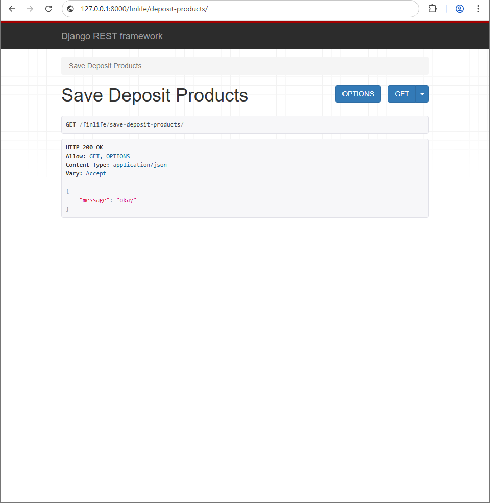
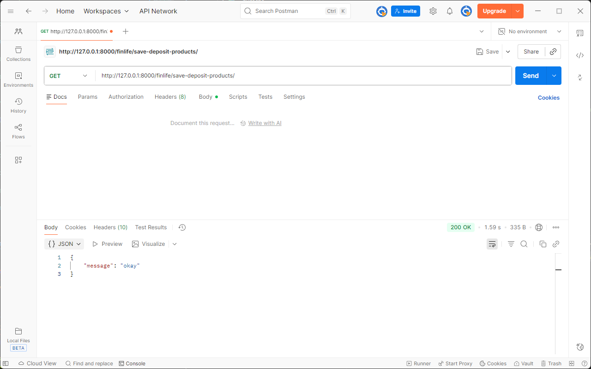

### 2-2. 데이터 조회 - 전체 정기예금 상품 목록 출력

DB에 저장된 모든 정기예금 상품 정보를 JSON 형태로 반환한다.

-   **URL**: `GET /finlife/deposit-products/`
-   **HTTP Method**: `GET`
-   **설명**:
    -   `DepositProducts` 테이블에 저장된 전체 상품 목록을 조회한다.
    -   `DepositProductsSerializer`를 사용하여 JSON 응답을 생성한다.
    -   데이터가 하나도 없을 경우 `get_list_or_404`를 통해 404 응답을 반환한다.

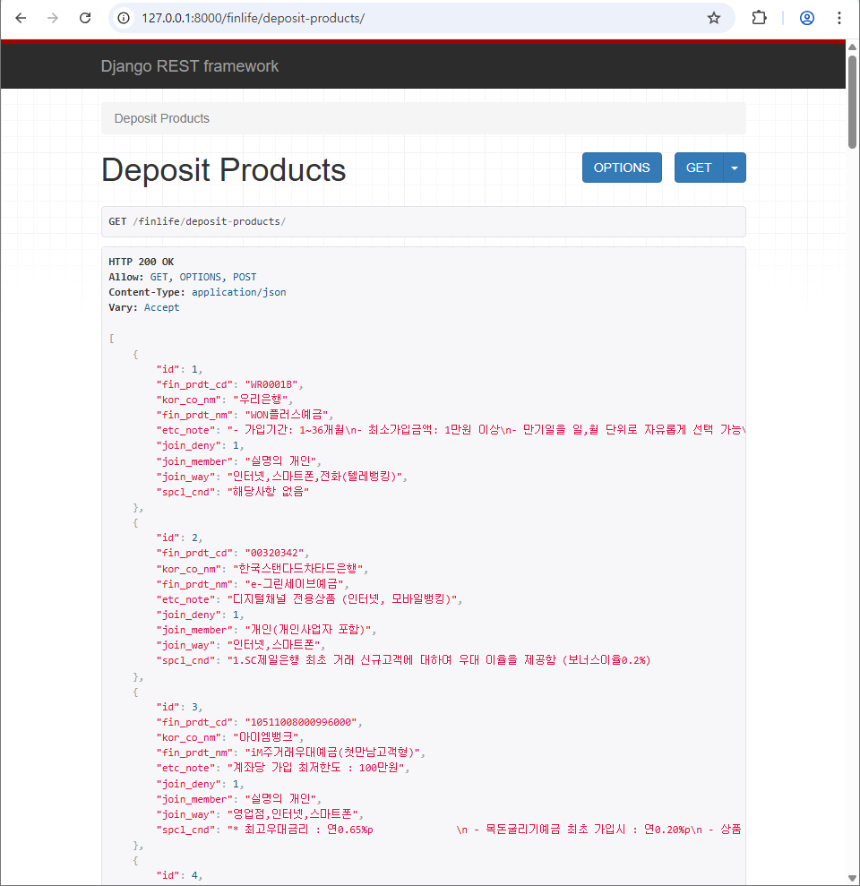

### 2-3. 데이터 입력 - 정기예금 상품 추가

요청 본문(POST 요청)을 통해 새로운 금융상품 데이터를 DB에 추가한다.

-   **URL**: `POST /finlife/deposit-products/`
-   **HTTP Method**: `POST`
-   **설명**:
    -   클라이언트가 전송한 JSON 데이터를 `DepositProductsSerializer`로 검증한다.
    -   유효한 경우 새 `DepositProducts` 레코드를 생성하고, 생성된 객체를 응답으로 반환한다.
    -   유효성 검증에 실패하면 DRF 기본 형식의 400 응답을 반환한다.

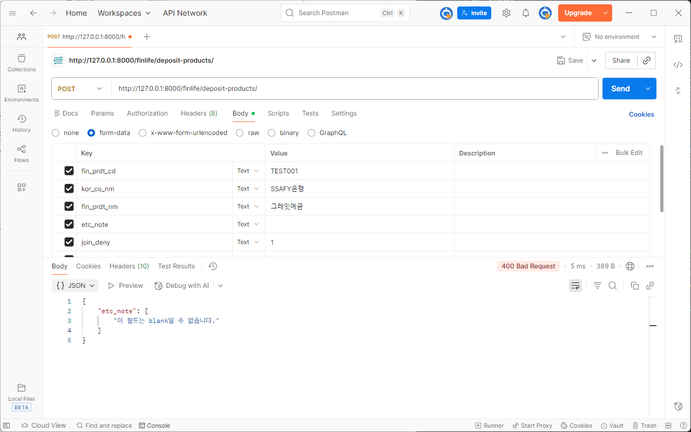
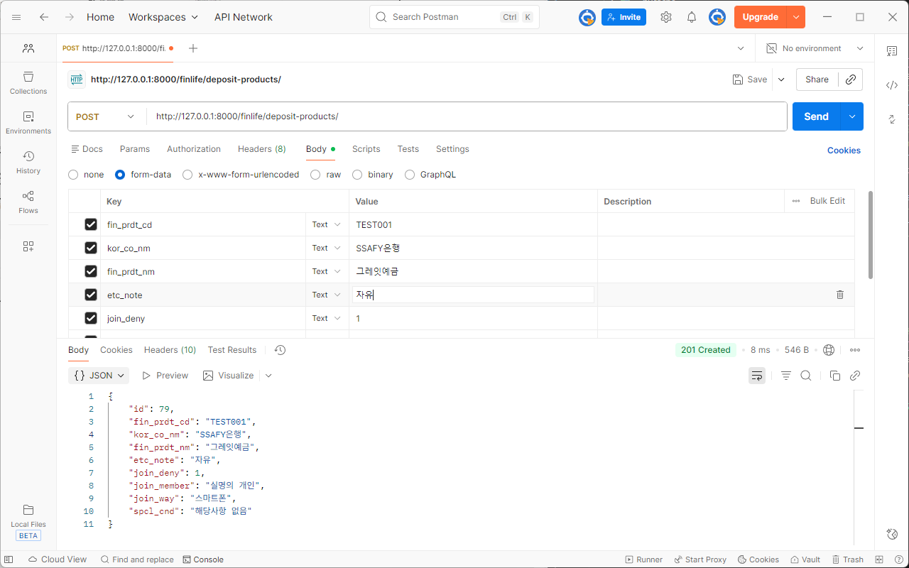

### 2-4. 데이터 조회 - 특정 상품 옵션 리스트 출력

상품코드(`fin_prdt_cd`)를 기준으로 해당 상품 옵션 정보를 조회하여 반환한다.

-   **URL**: `GET /finlife/deposit-products-options/<fin_prdt_cd>/`
-   **HTTP Method**: `GET`
-   **설명**:
    -   `DepositOptions` 테이블에서 `fin_prdt_cd`가 일치하는 모든 옵션을 조회한다.
    -   `DepositOptionsSerializer`를 사용하여 JSON 배열로 응답한다.
    -   해당 상품 코드에 대한 옵션이 없으면 404 응답을 반환한다.

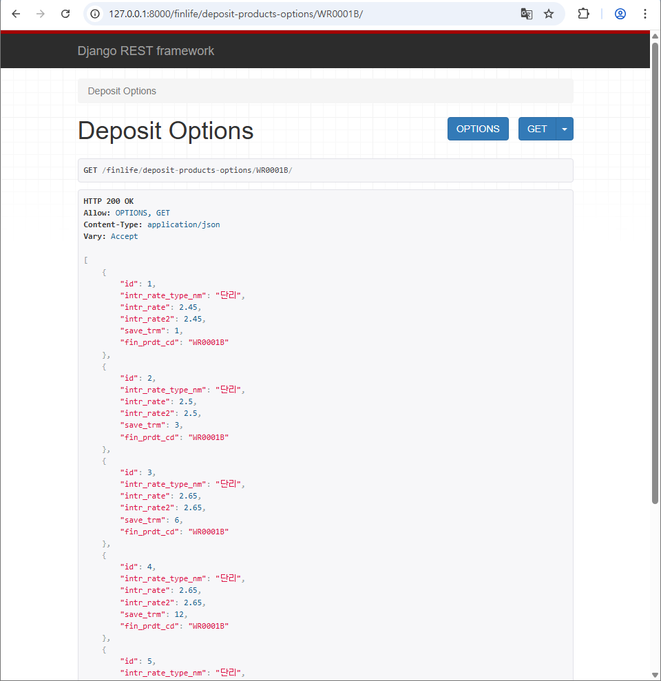
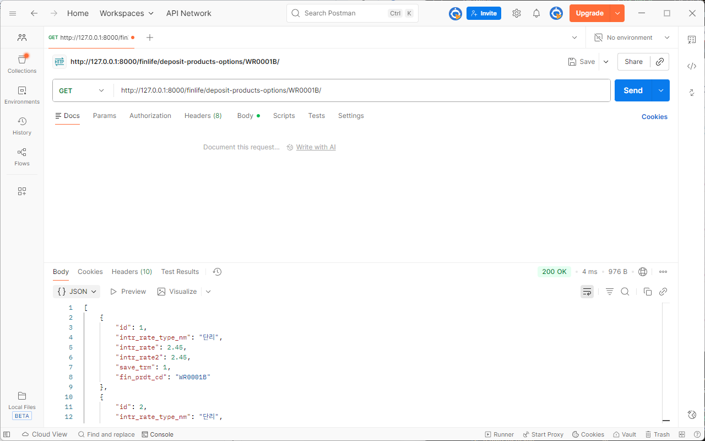

### 2-5. 데이터 분석 - 최고 금리 상품 조회

모든 상품 중 최고 우대금리가 가장 높은 상품과 그 옵션을 함께 반환한다.

-   **URL**: `GET /finlife/deposit-products/top-rate/`
-   **HTTP Method**: `GET`
-   **설명**:

    -   `DepositOptions.objects.order_by('-intr_rate2').first()`로 전체 옵션 중 최고 우대금리 옵션 1개를 조회한다.
    -   `TopRateSerializer`를 사용해

        -   `deposit_product` : 해당 옵션이 속한 `DepositProducts` 정보
        -   `options` : 해당 옵션 정보

        를 하나의 JSON으로 감싸서 응답한다.

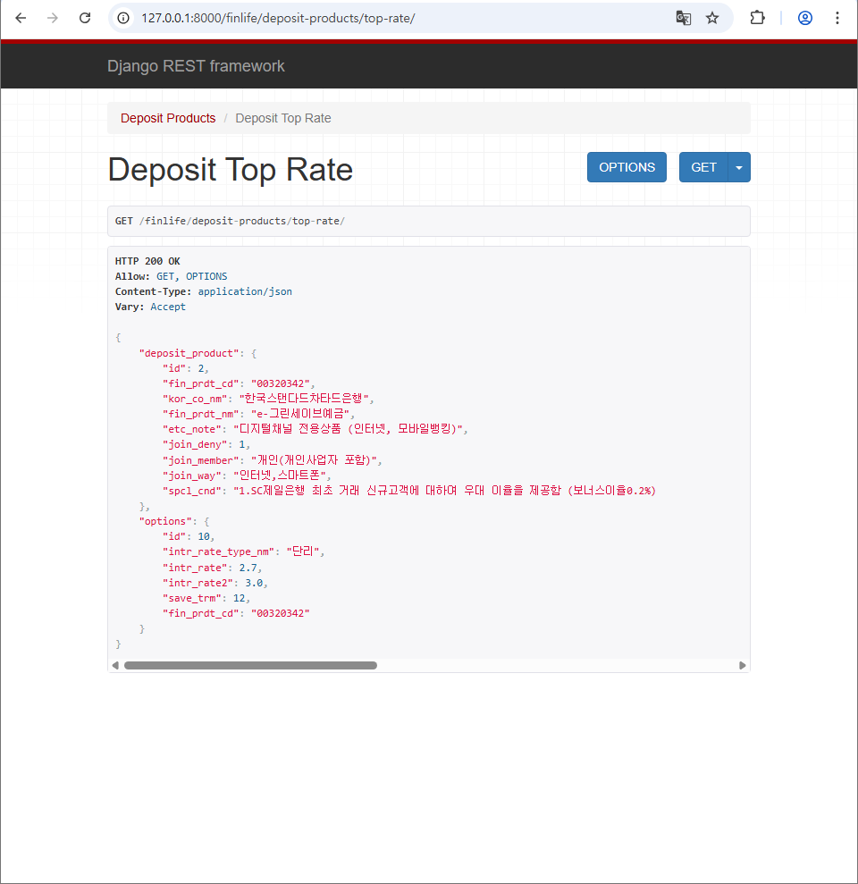
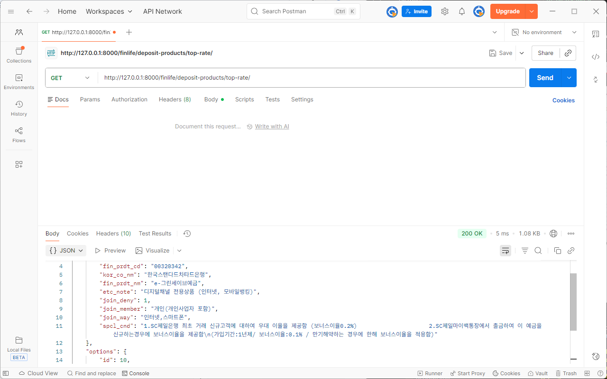

## 3. 학습 내용

### 3-1. Django REST Framework의 기본 흐름

-   `Model` -> `Serializer` -> `View(API)` -> `URL`로 이어지는 전형적인 DRF 패턴을 실제로 적용해보았다.
-   `ModelSerializer`를 사용하면, 모델 필드 정의만으로도 빠르게 API를 잡을 수 있다는 것을 알게되었다.

### 3-2. 외부 OpenAPI 연동 경험

-   금융감독원 "금융상품통합비교공시" 정기예금 API를 직접 호출하여, JSON 응답을 파싱하고 내부 DB 스키마에 맞게 매핑하는 과정을 경험했다.
-   `baseList` / `optionList`처럼 하나의 API 응답이 여러 테이블로 쪼개지는 케이스를 다루면서, 도메인 분석과 모델 설계의 중요성을 느꼈다.

### 3-3. 1:N 관계 모델링 및 조회

-   하나의 예금 상품에 여러 기간/금리 옵션이 달릴 수 있어 `ForeignKey` 로 1:N 구조를 구현했다.
-   특정 상품 코드 기준으로 옵션 리스트를 조회하는 API를 구현하면서, `get_list_or_404`, `filter`, `ForeignKey`의 사용법을 복습할 수 있었다.

### 3-4. 데이터 분석형 API 설계

-   단순 조회가 아닌, "최고 우대금리를 가진 상품/옵션"을 찾아주는 API를 직접 만들면서,
    -   정렬(`order_by('-intr_rate2')`)
    -   상위 1개 선택(`first()`)
    -   응답을 한 덩어리로 감싸는 커스텀 Serializer(`TopRateSerializer`) 같은 패턴을 연습하였다.
-   이를 통해 엔드포인트를 설계하는 감각을 얻을 수 있었다.

### 3-5. 환경 변수와 보안에 대한 이해

-   `.env` + `django-environ`을 통해 API_KEY를 관리하면서, 민감한 정보를 코드에 직접 넣지 않는 것이 왜 중요한지 다시 한 번 느꼈다.

### 3-6. API 문서 자동화의 편리함

-   drf-spectacular를 통해 Swagger / Redoc 문서를 자동 생성해 보니, 수동으로 명세서를 관리하는 것보다 훨씬 효율적이라는 것을 체감했다.
-   팀 개발이나 협업 상황에서 이런 도구들이 얼마나 중요한 역할을 할 지 상상해볼 수 있었다.
    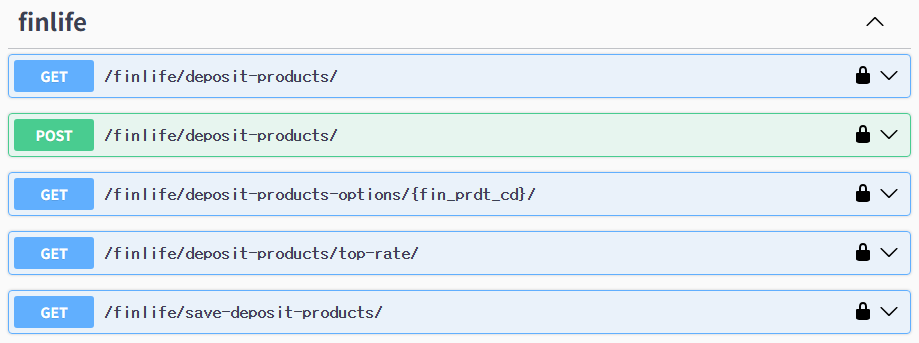
    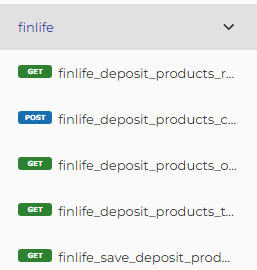

## 4. 느낀 점

-   단순히 “Django로 웹 페이지를 렌더링”하는 것이 아니라,
    **외부 데이터를 가져와서 가공하고, REST API로 제공하는 백엔드 서버**를 직접 만들어 보면서
    백엔드 개발자가 하는 일을 더 구체적으로 상상할 수 있게 되었다.

-   처음에는 금융감독원 API 구조(`baseList`, `optionList`)가 낯설었지만,
    하나씩 필드를 확인하고 모델에 옮겨 적는 과정을 거치면서
    “문서 → 코드 → DB”로 이어지는 흐름을 경험할 수 있었다.

-   DRF의 Serializer는 단순한 “직렬화 도구”가 아니라,
    **API 응답 스키마를 정의하고, 유효성 검증까지 담당하는 핵심 컴포넌트**라는 점을 이해하게 되었다.

-   이번 프로젝트를 통해 배운 패턴(모델 설계, 외부 API 연동, Serializer, Swagger 문서화 등)은
    이후에 다른 도메인(예: 주식 API 등)을 다룰 때도
    거의 그대로 재사용할 수 있을 것 같아서, 재사용 가능한 “템플릿”을 하나 얻은 느낌이다.
